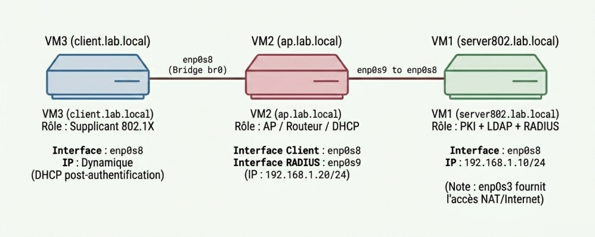
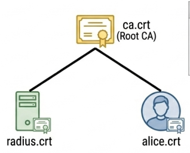
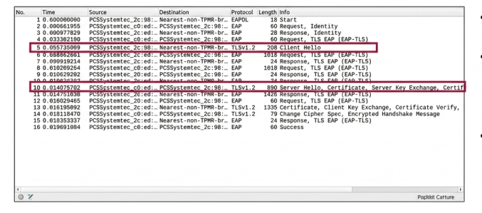

# 🔐 Infrastructure d'authentification 802.1X/EAP-TLS avec PKI privée et annuaire LDAP

> A complete certificate-based network authentication infrastructure using 802.1X/EAP-TLS, built with OpenSSL PKI, OpenLDAP, FreeRADIUS, hostapd, and wpa_supplicant — deployed across three VirtualBox VMs.

---

## 📋 Table of Contents

- [Overview](#overview)
- [Architecture](#architecture)
- [Components](#components)
- [Authentication Flow](#authentication-flow)
- [Prerequisites](#prerequisites)
- [Project Structure](#project-structure)
- [Setup Guide](#setup-guide)
  - [VM1 — PKI (OpenSSL)](#vm1--pki-openssl)
  - [VM1 — OpenLDAP](#vm1--openldap)
  - [VM1 — FreeRADIUS](#vm1--freeradius)
  - [VM2 — hostapd + Routing + DHCP](#vm2--hostapd--routing--dhcp)
  - [VM3 — wpa_supplicant (Client)](#vm3--wpa_supplicant-client)
- [Validation with Wireshark](#validation-with-wireshark)
- [Results](#results)
- [Resources](#resources)
- [Author](#author)

---

## Overview

This project deploys a full 802.1X network authentication infrastructure using the **EAP-TLS** protocol. Instead of passwords, authentication relies exclusively on **digital certificates**, providing mutual and cryptographically strong authentication.

The setup simulates a real enterprise network architecture across three VirtualBox virtual machines.

### Key Security Properties
- ✅ **No passwords** — certificates are the only credentials
- ✅ **Mutual TLS authentication** — both client and server verify each other
- ✅ **Private PKI** — full control over certificate issuance
- ✅ **LDAP authorization** — centralized user directory
- ✅ **Port-based access control** — 802.1X blocks the port until authentication succeeds

---

## Architecture



### IP Addressing

| VM | Hostname | Interface | IP Address | Role |
|----|----------|-----------|------------|------|
| VM1 | server802.lab.local | enp0s3 | NAT | Internet access |
| VM1 | server802.lab.local | enp0s8 | 192.168.1.10/24 | PKI + LDAP + RADIUS |
| VM2 | ap.lab.local | enp0s8 | CLIENT SIDE | AP (client-facing) |
| VM2 | ap.lab.local | enp0s9 | 192.168.1.20/24 | AP (RADIUS-facing) |
| VM2 | ap.lab.local | br0 | Bridge | Router + DHCP |
| VM3 | client.lab.local | enp0s8 | DHCP (post-auth) | 802.1X Supplicant |

### Naming Plan

| Entity | Name | CN (Certificate) |
|--------|------|-----------------|
| Certificate Authority | LabCA | — |
| RADIUS Server | radius.server802.lab.local | server802.lab.local |
| Client | alice | alice@lab.local |
| LDAP Domain | dc=lab,dc=local | lab.local |

### Trust Anchor (PKI Chain of Trust)

The Certificate Authority (`LabCA`) is the single root of trust for the entire infrastructure. Every entity — RADIUS server and client — holds a copy of `ca.crt` and uses it to verify the other party's certificate during the mutual TLS handshake.



---

## Components

| Component | Technology | VM |
|-----------|------------|-----|
| Certificate Authority (PKI) | OpenSSL | VM1 |
| User Directory | OpenLDAP | VM1 |
| Authentication Server | FreeRADIUS | VM1 |
| Access Point / Router / DHCP | hostapd + iptables + isc-dhcp-server | VM2 |
| 802.1X Supplicant (Client) | wpa_supplicant | VM3 |

---

## Authentication Flow

```
VM3 (Client)          VM2 (AP / Relay)         VM1 (RADIUS)
     │                       │                       │
     │──── EAPOL-Start ──────►│                       │
     │◄─── EAP-Request/ID ───│                       │
     │──── EAP-Response/ID ──►│                       │
     │                       │──RADIUS Access-Req ───►│
     │                       │◄─RADIUS Challenge ────│
     │◄────── TLS Client Hello (tunneled) ────────────│
     │──────── Server Hello + radius.crt ─────────────►│
     │  [Verify radius.crt against ca.crt]            │
     │──── alice.crt + Cert Verify + Finished ────────►│
     │                       │  [Verify alice.crt]    │
     │                       │  [LDAP lookup: alice]  │
     │                       │◄─RADIUS Access-Accept─│
     │◄─── EAP-Success ──────│                       │
     │──── DHCP Discover ────►│                       │
     │◄─── DHCP Offer/ACK ───│                       │
```

> **Important:** VM3 and VM1 never communicate directly. VM2 is the relay: it encapsulates EAP messages into RADIUS packets toward VM1 and forwards responses back to VM3. The TLS tunnel is end-to-end between VM3 and VM1 — VM2 is opaque to its content.

---

## Prerequisites

- VirtualBox (3 VMs running Ubuntu/Debian)
- The following packages on each VM:

**VM1:**
```bash
sudo apt install openssl slapd ldap-utils freeradius
```

**VM2:**
```bash
sudo apt install hostapd isc-dhcp-server bridge-utils
```

**VM3:**
```bash
sudo apt install wpasupplicant
```

---

## Project Structure

```
802.1X-EAP-TLS-Infrastructure/
│
├── README.md
│
├── docs/
│   ├── rapport.pdf                        # Full project report (French)
│   └── presentation.pptx                  # Slide deck
│
├── pki/
│   ├── generate-ca.sh                     # Generate root CA
│   ├── generate-radius-cert.sh            # Generate RADIUS server cert
│   └── generate-client-cert.sh            # Generate client cert (alice)
│
├── vm1-server/
│   ├── ldap/
│   │   ├── base.ldif                      # LDAP base structure
│   │   └── alice.ldif                     # Alice user entry
│   └── freeradius/
│       ├── eap                            # EAP-TLS module config
│       └── clients.conf                   # RADIUS clients (AP declaration)
│
├── vm2-ap/
│   ├── hostapd.conf                       # Access point config
│   ├── dhcpd.conf                         # DHCP server config
│   └── routing-setup.sh                   # iptables + IP forwarding rules
│
└── vm3-client/
    └── wpa_supplicant.conf                # EAP-TLS supplicant config
```

---

## Setup Guide

### VM1 — PKI (OpenSSL)

Generate the root CA and all certificates:

```bash
# Root CA (4096-bit, 10 years)
openssl genrsa -out ca.key 4096
openssl req -new -x509 -days 3650 -key ca.key -out ca.crt \
  -subj "/CN=LabCA/O=Lab/C=TN"

# RADIUS server certificate
openssl genrsa -out radius.key 2048
openssl req -new -key radius.key -out radius.csr \
  -subj "/CN=radius.server802.lab.local"
openssl x509 -req -days 365 -in radius.csr -CA ca.crt -CAkey ca.key \
  -CAcreateserial -out radius.crt

# Client certificate (alice)
openssl genrsa -out alice.key 2048
openssl req -new -key alice.key -out alice.csr \
  -subj "/CN=alice@lab.local/O=Lab"
openssl x509 -req -days 365 -in alice.csr -CA ca.crt -CAkey ca.key \
  -CAcreateserial -out alice.crt
```

Copy `ca.crt` to all VMs. Copy `alice.crt` + `alice.key` to VM3.

---

### VM1 — OpenLDAP

```bash
# Start slapd
sudo systemctl start slapd

# Load base.ldif and alice.ldif
ldapadd -x -D "cn=admin,dc=lab,dc=local" -W -f base.ldif
ldapadd -x -D "cn=admin,dc=lab,dc=local" -W -f alice.ldif

# Verify
ldapsearch -x -b "dc=lab,dc=local"
```

---

### VM1 — FreeRADIUS

Edit `/etc/freeradius/3.0/mods-enabled/eap`:

```
default_eap_type = tls

tls-config tls-common {
    private_key_file = /etc/freeradius/3.0/certs/radius.key
    certificate_file = /etc/freeradius/3.0/certs/radius.crt
    ca_file          = /etc/freeradius/3.0/certs/ca.crt
    tls_min_version  = "1.2"
    tls_max_version  = "1.2"
}
```

Declare the AP in `/etc/freeradius/3.0/clients.conf`:

```
client ap.lab.local {
    ipaddr    = 192.168.1.20
    secret    = your_secret_key
    nas_type  = other
}
```

---

### VM2 — hostapd + Routing + DHCP

`hostapd.conf`:

```
interface=enp0s8
bridge=br0
driver=wired
ieee8021x=1
eap_server=0
auth_server_addr=192.168.1.10
auth_server_port=1812
auth_server_shared_secret=your_secret_key
```

> The `wired` driver is used because VirtualBox provides Ethernet (802.3) interfaces, not Wi-Fi. The 802.1X/EAP-TLS protocol is identical on both media types.

---

### VM3 — wpa_supplicant (Client)

`/etc/wpa_supplicant/wpa_supplicant-client1.conf`:

```
ap_scan=0

network={
    key_mgmt=IEEE8021X
    eap=TLS
    identity="alice"
    ca_cert="/etc/certs/ca.crt"
    client_cert="/etc/certs/alice.crt"
    private_key="/etc/certs/alice.key"
    eapol_flags=0
}
```

Start authentication:

```bash
sudo wpa_supplicant -i enp0s8 -D wired \
  -c /etc/wpa_supplicant/wpa_supplicant-client1.conf
```

Expected output on success:

```
enp0s8: CTRL-EVENT-EAP-STARTED EAP authentication started
enp0s8: CTRL-EVENT-EAP-METHOD EAP vendor 0 method 13 (TLS) selected
enp0s8: CTRL-EVENT-EAP-SUCCESS EAP authentication completed successfully
enp0s8: CTRL-EVENT-CONNECTED - Connection to ... completed
```

---

## Validation with Wireshark

Capture on different interfaces to observe the full flow:

| Capture Point | Interface | What You See |
|---------------|-----------|--------------|
| VM3 (client) | enp0s8 | EAPoL, EAP, TLS, DHCP (no RADIUS) |
| VM2 (client side) | enp0s8 | EAPoL, EAP, TLS, DHCP |
| VM2 (RADIUS side) | enp0s9 | RADIUS Access-Request/Challenge/Accept |
| VM2 (best point) | enp0s8 + enp0s9 | All flows simultaneously |

**Useful Wireshark filters:**
```
eap        # EAP frames
eapol      # EAPoL frames (802.1X)
radius     # RADIUS packets (UDP 1812)
tls        # TLS handshake
dhcp       # DHCP exchange
```



---

## Results

The full EAP-TLS handshake was successfully completed and validated:

- ✅ Mutual TLS authentication between alice (VM3) and FreeRADIUS (VM1)
- ✅ RADIUS `Access-Accept` issued after certificate validation
- ✅ Port unlocked by hostapd after `EAP-Success`
- ✅ DHCP address assigned to client after authentication
- ✅ Wireshark capture confirms each step of the negotiation

---

## Resources

- [IEEE 802.1X Standard](https://en.wikipedia.org/wiki/IEEE_802.1X)
- [EAP-TLS — RFC 5216](https://datatracker.ietf.org/doc/html/rfc5216)
- [FreeRADIUS Documentation](https://wiki.freeradius.org/)
- [OpenLDAP Documentation](https://www.openldap.org/doc/)
- [wpa_supplicant Manual](https://linux.die.net/man/8/wpa_supplicant)
- [hostapd Documentation](https://w1.fi/hostapd/)

---

## Author

**Fedi Nasri** — [github.com/Fedi-Nasri](https://github.com/Fedi-Nasri)

*Project completed in 2026 as part of a network security infrastructure study.*
